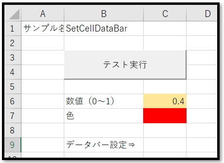
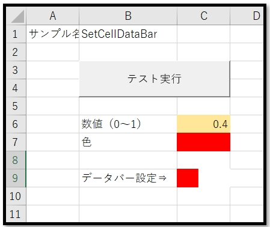
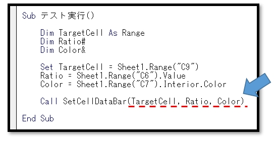

# VBA-SetCellDataBar
- License: The MIT license

- Copyright (c) 2021 YujiFukami

- 開発テスト環境 Excel: Microsoft® Excel® 2019 32bit 

- 開発テスト環境 OS: Windows 10 Pro

実行環境など報告していただくと感謝感激雨霰。

# 説明
セルの書式設定で0～1の値に基づいて、データバーを設定する

## 活用例
棒グラフを用いずに値の比較ができるようになる。

# 使い方
実行サンプル「Sample-SetCellDataBar.xlsm」の中の使い方は以下の通り。

サンプル中身

セル[C6]に0～1の数値を入力する

セル[C7]に塗りつぶし色でデータバーの色を設定する。

「テスト実行」ボタンを押した後

セル[C9]にデータバーが設定される。

プロシージャ中身

プロシージャ「SetCellDataBar」が使われている。

引数は

-  TargetCell  対象のセル（Range型）

-  Ratio       データバーの割合値（Double型）

-  Color　　　 データバーの色（Long型）

## 設定
実行サンプル「Sample-SetCellDataBar.xlsm」の中の設定は以下の通り。

### 設定1（使用モジュール）

-  ModTest.bas
-  ModSetCellDataBar.bas

### 設定2（参照ライブラリ）
なし

